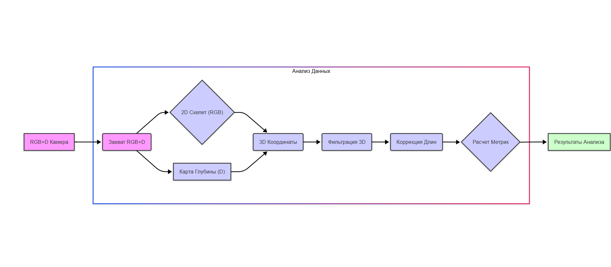

# Система для безмаркерного захвата движений кисти на основе ToF-камеры Orbbec Femto Bolt

## Цель проекта
Разработка системы для безмаркерного захвата движений кисти, способной восстанавливать 3D-скелет кисти и анализировать качество выполнения движений на основе расчёта количественных метрик.

## Постановка задач
- Разработать набор упражнений и метрик для медицинской реабилитации.
- Создать систему захвата и предварительной обработки RGB+D видео.
- Реализовать алгоритм получения 3D-скелета кисти.
- Разработать модуль коррекции нестабильности длины суставов.
- Провести сравнение точности на RGB+D и RGB видео.
- Создать модуль автоматизированного расчета метрик.

## Структура проекта


hand-tracking-system/
- ├── configs                 # Примеры конфигураций для нескольких типов рассматриваемых упражнений 
- ├── metrics                 # Примеры расчетов метрик для нескольких типов рассматриваемых упражнений 
- ├── output                  # Все промежуточные и итоговые результаты построения скелетов содержатся в этой директории 
- ├── config.py               # Конфигурационные параметры системы 
- ├── data_io.py              # Функции для работы с данными 
- ├── kalman_filter_module.py # Реализация фильтра Калмана 
- ├── keypoint_detector.py    # Детектор ключевых точек 
- ├── main.py                 # Основной скрипт обработки 
- ├── skeleton_analyzer.py    # Анализ скелета и костных структур 
- ├── skeleton_optimizer.py    # Оптимизатор с жесткими ограничениями 
- ├── skeleton_optimizer_not_static.py # Оптимизатор без жестких ограничений 
- ├── utils.py                # Вспомогательные функции 
- └── visualization.py        # Визуализация результатов 


## Установка и запуск
1. Установите зависимости:
   ```bash
   pip install -r requirements.txt
```

1. Настройте параметры в файле ```
   config.py
   ```

   :
   - Пути к данным
   - Параметры камеры
   - Настройки фильтрации и оптимизации
2. Запустите основной скрипт:

   ```
   python main.py
   
   ```

## Основные функции

### Детекция ключевых точек

- Использует MediaPipe для 2D детекции.
- Преобразует координаты в 3D с использованием данных глубины.

### Фильтрация Калмана

- Сглаживание траекторий ключевых точек.
- Устранение шумов и выбросов.

### Оптимизация скелета

- Два подхода: с жесткими и нежесткими ограничениями.
- Коррекция длин костных сегментов.




P.S. Код форматирован при помощи Google Gemini
